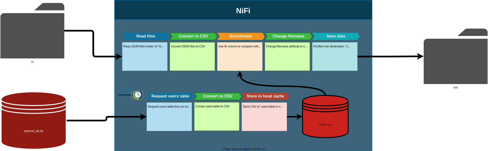
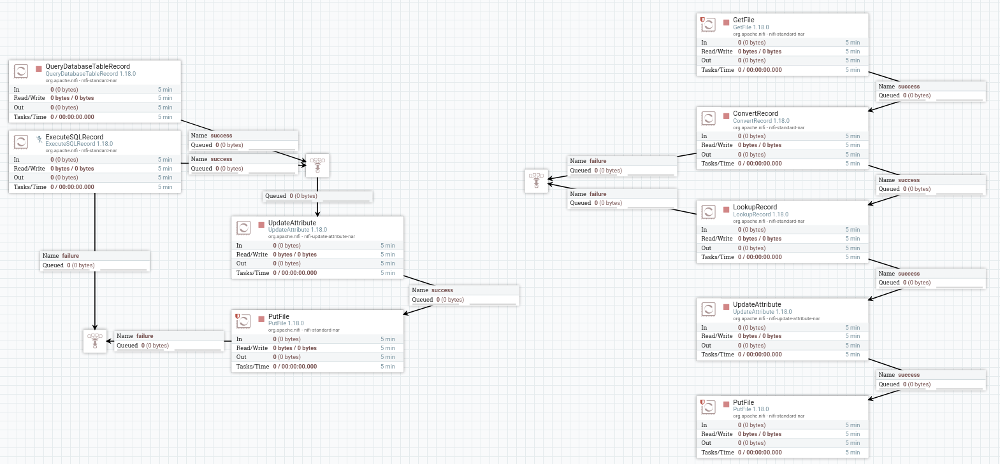

# Objective:
Take JSON files and enrich them with data from an external database using NiFi. The data-flow mockup is the following:

# Test preparation
Run `prepare_test.py`. This will create test files inside `in` directory and create `external_db.db` with some entries.

# NiFi final template
The NiFi template with the exercise resolution: `data_enrichment.xml`.

To implement this template you must replace `replace_this_path` with your working directory and `replace_this_sql_driver_location` with your sql driver location in [data_enrichment.xml](data_enrichment.xml).

